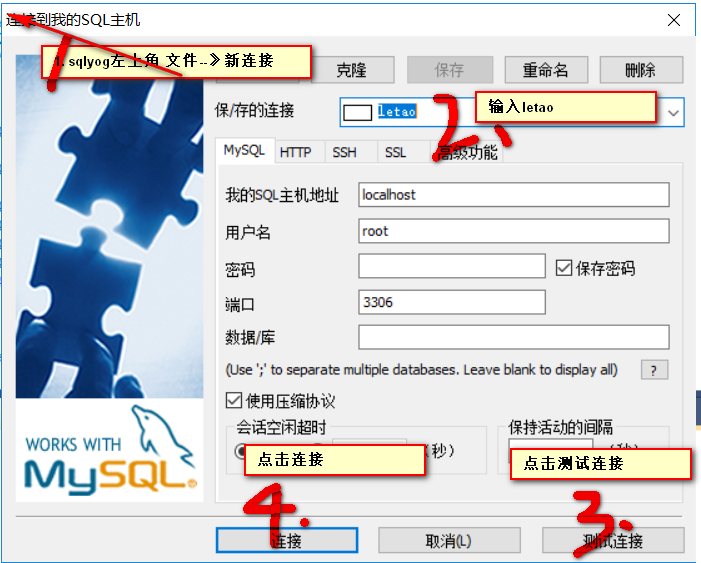
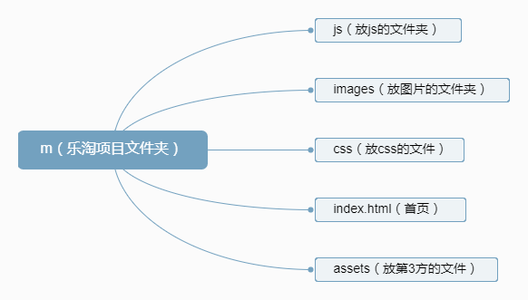

# 乐淘第一天

## 今日重点
1. 配置乐淘项目环境
2. MUI轮播图及滚动的使用
3. 分类页一级二级渲染

## 今日学习大纲 210*5.2/04-06-09/12-14

### 项目搭建开发环境
1. 把letao文件夹放到你们的服务器的目录下，要保证没有任何中文目录
2. 进入到当前letao文件目录，按住shift不放点击鼠标右键，找到在此处打开命令窗口点击
3. 执行命令`npm i`（执行后会帮助我们下载所需的依赖）
4. 安装SQLyog
 1. 找到课程资料的sqlyog目录进入
 2. 根据自己的操作系统选择目录进入->双击.exe尾缀文件启动安装...
 3. 使用sqlyog目录下的`安装必看.txt`文件注册
 4. 连接
    

5. 找到`letao/docs/letao初始化.sql`文件中->在编辑器中打开->ctrl+a ->ctrl+c->在sqlyog右侧查询窗口ctrl+v粘贴 -> 然后选中全部sql语句 ->点击左侧按钮执行
6. 连接数据库到项目 找到\models目录下的db.js打开核对用户名和密码等信息，一般情况下没有问题

7. 启动项目--》找到letao-master项目根目录shift+鼠标右键打开cmd--》输入npm start回车

8. http://localhost:3000/mobile/和http://localhost:3000/manage/login.html

### MUI介绍
- [MUI官网介绍](http://dev.dcloud.net.cn/mui/)

- [MUI界面展示](http://www.dcloud.io/hellomui/)

- 框架特点
+ 对比bootstrap一个是专注于解决PC、平板、移动端的兼容，但是MUI针对于移动端
+ 轻量--》体积比较小
+ ui风格--》mui以iOS7的ui为基础，补充了部分android系统特有的ui控件、mui更接近原生app的ui体验
+ 原生加速--》mui框架封装了webview的操作
+ 快速原型开发--》HBuilder中内置了mui的所有代码块

### letao移动端项目m开始

#### 移动端项目架子构建


#### 首页
- 页面架子  
```html
<!DOCTYPE html>
<html>
<head lang="en">
  <meta charset="UTF-8">
  <meta name="viewport" content="width=device-width,initial-scale=1.0,user-scalable=0"/>
  <title>乐淘首页</title>
  <link rel="stylesheet" href="assets/mui/css/mui.css"/>
  <link rel="stylesheet" href="css/common.css"/>
</head>
<body>
  <div class="lt_container">
      <header class="lt_topBar"></header>
      <div class="lt_content">
          1
      </div>
      <footer class="lt_tabBar"></footer>
  </div>
<script src="assets/mui/js/mui.js"></script>
</body>
</html>
```

- 初始区域滚动插件 [区域滚动](http://dev.dcloud.net.cn/mui/ui/#scroll)
```javascript
  /*初始化区域滚动组件 当超过了父容器大小的时候生效*/
  mui('.mui-scroll-wrapper').scroll();
```

- 初始化轮播图[轮播图](http://dev.dcloud.net.cn/mui/ui/#gallery)
```javascript
  /*轮播图的初始化*/
  mui('.mui-slider').slider({
      interval:4000
  });
```

- 首页的九宫格导航和列表详情展示静态页面

#### 分类页
- 静态结构

```html
<header class="lt_topBar">
  <a class="btn_left" href="javascript:history.back();"><span class="mui-icon mui-icon-arrowleft"></span></a>
  <h3>乐淘分类</h3>
  <a class="btn_right" href="search.html"><span class="fa fa-search"></span></a>
</header>
<div class="lt_content">
  <!--左侧栏-->
  <div class="lt_cateLeft">
      <ul>
          <!--动态渲染-->
      </ul>
  </div>
  <!--右内容-->
  <div class="lt_cateRight">
      <ul class="mui-clearfix">
          <!--动态渲染-->
      </ul>
  </div>
</div>
```

- 分类页左侧和右侧可滑动
```javascript
// 初始化左侧滚动
mui('.lt_cateLeft').scroll()
// 初始化右侧滚动
mui('.lt_cateRight').scroll()

```

- 分类页左侧和右侧默认渲染

```javascript
firstCategoryGetData(function(res) {
      console.log(res, '一级分类数据')
      // 1.1. 渲染一级分类
      $('.lt_cateLeft ul').html(template('firstCategory', res))
      
      // 1.2. 根据一级分类的id去请求 渲染二级分类
      // 获取一级分类第一分类的id
      var id = res.rows[0].id
      secondCategoryGetData({id: id}, function (data) {
          console.log(data, '二级分类数据')
          $('.lt_cateRight ul').html(template('secondCategory', data))
      })
  })

```

- 分类页左右联动

```javascript
  $('.lt_cateLeft ul').on('tap', 'li', function() {
  	// 2.0 二级列表滚动到初始位置
  	scrollRight.scrollTo(0, 0, 100)
  	// 2.1.获取当前id
  	var id = $(this).data('id')
  	// console.log(id)
  	// 2.2. 请求2级分类数据 
  	secondCategoryGetData({id: id}, function (data) {
          console.log(data, '点击一级分类得到的二级分类数据')
          // 2.2.1 如果返回数据为空 需要在模板中 判断显示无数据提示
          $('.lt_cateRight ul').html(template('secondCategory', data))
      })
  	
  	// 2.3 左侧一级分类tab效果
  	$(this).addClass('now').siblings().removeClass('now')
  })
```


# 乐淘第二天

## 今日重点
1. 本地存储(localStorage)的获取与存储
2. 下拉刷新和上拉加载
3. this的指向
4. js和jq对象互转即获取data属性

## 今日学习大纲 211*5.2/04-06-09/12-14

### 搜索页
- 骨架结构

```html
<div class="lt_wrapper">
    <div class="mui-scroll-wrapper">
        <div class="mui-scroll">
            <!--搜索表单-->
            <div class="lt_search">
                <form action="javascript:;">
                    <input class="search_input" type="search" placeholder="请输入搜索关键字"/>
                    <a class="search_btn" href="javascript:;">搜索</a>
                </form>
            </div>
            <!--搜索历史-->
            <div class="lt_history">
               <!--动态渲染-->
            </div>
        </div>
    </div>
</div>
```
```javascript
// common.js中的是搜索页可以滚动
mui('.mui-scroll-wrapper').scroll({
	deceleration: 0.0005 //flick 减速系数，系数越大，滚动速度越慢，滚动距离越小，默认值0.0006
});

```

- 搜索页功能分析，难点在与本地存储历史记录与获取
  [搜索页功能分析](http://naotu.baidu.com/file/8238a54b581c722ae91a922761d136cc?token=e135741396695821)
- `补充`获取data属性的方式

```javascript
// 获取当前按钮点击时的 data-index属性  即索引
// var index = $(this).data('index')                // jq的data方法获取
// var index = $(this).attr('data-index')           // jq的attr方法获取
// var index = $(this)[0].dataset.index             // H5获取data属性
var index = $(this)[0].getAttribute('data-index')   // js获取getAttribute属性
```

- 补充this指向

```
// 1. this --> var that = this
// 2. this --> bind(this)
// 3. this --> () => {}
```


### 搜索列表页
#### 页面加载初始化页面数据
1. 获取地址栏关键字
2. 通过关键字去后台获取和关键字相关的商品数据
3. 渲染商品列表

#### 搜索表单
1. 点击搜索按钮 获取到关键字
2. 通过关键字去后台获取和关键字相关的商品数据
3. 渲染商品列表

#### 搜索排序
1. 点击排序按钮 获取排序方式
2. 通过当前的关键字和排序方式去后台获取相关的商品数据
3. 渲染商品列表

#### 下拉刷新
1. 当用户下拉页面
2. 通过关键字去后台重新获取和关键字相关的商品数据
3. 渲染商品列表

#### 上拉加载
1. 当用户上拉页面
2. 通过关键字去后台获取和关键字相关的商品数据（而且是根据当前页面进行获取）
3. 渲染商品列表 当时是追加到页面当中


# 乐淘第三天

## 今日重点
1. 轮播图和数量模块放在模板中要重新初始化
2. 反复提交的验证，即开关
3. 购物车的删除功能

## 今日学习大纲 265*2.0/04-06-09/12-14

### 商品详情页
#### 默认初始化渲染商品信息
1.  获取页面的productId
2.  请求获取数据
3.  动态模板渲染
4.  初始化轮播图


#### 点击重加载按钮 刷新商品信息

```javascript
$('.mui-icon-reload').on('tap',function(){
    $('.mui-scroll').html('<div class="loading"><span class="mui-icon mui-icon-spinner"></span></div>')
    render()
})
```

#### 尺码选择
```javascript
$('.mui-scroll').on('tap','.size',function(){
    $(this).addClass('now').siblings().removeClass('now')
})
```

#### 数量选择
1.  数量选择初始化 ---页面加载和轮播图一起初始化

#### 加入购物车
```javascript
// 4.4 防止重复提交
if (window.addCarting) {
   return
}
// 4.1 去购物车必须要传递三个参数 productId num size
var params = {
   productId: productId,
   size: $('.size.now').html(),
   num: $('.mui-input-numbox').val()
}
// 4.2 验证信息是否全
if (!params.productId) {
   mui.toast('商品id异常')
   return
}
if (!params.size) {
   mui.toast('请选择尺码')
   return
}
if (!params.num) {
   mui.toast('请选择商品数量')
   return
}

// 4.3 发送ajax请求
$.ajax({})
```

### 登录页
#### 登录功能
1. 获取用户名和密码
2. 用户名和密码不为空验证
3. 登录请求
4. 防止重复提交
5. code
   
```
if (res.success) {
	// 1.3.1 请求成功后返回到指定页面
	var returnUrl =window.location.search
	// console.log(returnUrl)
	// ?returnUrl=http://localhost:3000/m/product.html?productId=1
	if (returnUrl && returnUrl.indexOf('?returnUrl=') !== -1) {
		location.href = returnUrl.replace('?returnUrl=', '')
	} else { // 默认回到首页
		location.href = '/m/user/myindex.html'
	}
} else if (res.error === 403) {
	mui.toast('用户名或密码不存在，请确认后重试！')
	window.loading = false
}
```


### 购物车
- 展示购物车商品
```javascript
mui.init({ // 1.1 完成下拉刷新效果
    /*拉动刷新组件*/
    pullRefresh:{
        /*目标容器*/
        container:".mui-scroll-wrapper",
        /*下拉*/
        down:{
            /*默认下拉一次*/
            auto:true,
            /*下拉操作后的回调函数*/
            callback:function(){
                // 1.2 完成数据获取
                getCartData(function(data){
                    // 1.3 展示商品
                    $('.mui-table-view').html(template('cart',data))
                    // 1.4 清除加载效果
                    this.endPulldownToRefresh()
                }.bind(this))
            }
        }
    }
})
```

- 删除操作
  + 删除提醒
  + 确认删除发请求删除
  + 重新渲染数据
  
- 编辑操作
  + 用this.dataset获取商品相关信息
  + 定义编辑模板模板点击传入商品信息
  + 发请求
  + 重新渲染

- 总额计算
  + 给复选框注册change事件
  + 循环遍历选中复选框将单个商品总价累加
  + 将总价展示到页面上
  + 在商品修改和删除时候也重新渲染总价


# 乐淘第四天

## 今日重点
1. 前端校验插件的使用
2. 进度条插件的使用
3. 分页插件的使用

## 今日学习大纲 228*4.8/04-06-09/12-14

### 登录页

#### 前端校验功能
1. 用户名不能为空 
2. 密码不能为空
3. 密码在6-18个字符内
4. 基于bootstrap的前端校验插件 《bootstrapvalidator》资料
[bootstrapvalidator](http://blog.csdn.net/nazhidao/article/details/51542508)　
[BootstrapValidator超详细教程](http://blog.csdn.net/u013938465/article/details/53507109)　
[bootstrapValidator ](http://www.cnblogs.com/v-weiwang/p/4834672.html?ptvd)　
[api](http://bootstrapvalidator.votintsev.ru/api/)

#### 重置功能（内容、校验）

#### 登录功能  

1. 点击按钮 发送登录请求 后台管理员 root 123456
2. 登录成功 前端跳转到首页
3. 登录失败 恢复可提交状态，具体的提示某一个表单元素的错误信息
4. 进度显示 在ajax请求过程当中使用进度显示功能 [进度条插件](http://blog.csdn.net/joyhen/article/details/24458427)

```javascript
// 1. 配置全局ajax请求进度条功能
// 显示转圈效果
NProgress.configure({
    showSpinner: true
})
$(window).ajaxStart(function() {
	NProgress.start() // — 显示进度条
})
$(window).ajaxStop(function() {
	NProgress.done()  // — 完成进度条
})
```

#### 退出功能
1. 准备模态框
2. 把模态框追加到页面当中
3. 显示模态框
4. 当点击确定按钮的时候进行退出
5. 防止多次绑定  在绑定之前先注销上一次的绑定
6. 发送退出请求

```javascript
// 4.1 准备模态框
var logoutModal ='<div class="modal fade" id="logoutModal">' // ....
// 4.2 把模态框追加到页面当中
$('body').append(logoutModal)
// 4.3 显示模态框
$('#logoutModal').modal('show')
// 4.4 当点击确定按钮的时候进行退出
// 4.5 防止多次绑定  在绑定之前先注销上一次的绑定
$('#logoutModal').off('click','.btn-primary').on('click','.btn-primary',function(){
    // 4.6 发送退出请求
    $.ajax({// ...})
})
```


### 后台首页
#### echars
- [echars](http://echarts.baidu.com/index.html)
- 使用步骤
1. 引入 echarts.js
2. 为ECharts准备一个具备大小（宽高）的Dom
3. 基于准备好的dom，初始化echarts实例
4. 指定图表的配置项和数据
5. 使用刚指定的配置项和数据显示图表。

#### 用户管理页
1. 数据展示
2. 分页展示
3. 用户的启用与禁用


# 乐淘第五天

## 今日重点
1. 表单验证
2. 自定义表单验证使用
3. 图片上传插件的使用

## 今日学习大纲 211*5.2/04-06-09/12-14

### 一级分类页
1. 分类列表分页展示
2. 分页展示
3. 添加一级分类

```javascript
/* 1. 分类列表分页展示 */
var render = function () {
	// 1.1 初始化页面
	getCategoryFirstData({
		page: currentPage,
		pageSize: 2
	}, function(res) {
		// console.log(res)
		// 1.2 模板渲染
		$('.table tbody').html(template('firstCategoryTpl', res))
		
		// 2.0 分页展示渲染
		setPaginator(res.page, Math.ceil(res.total / res.size), render)
	})
}
render()
/* 2. 分页展示 */
var setPaginator = function (cp, pages, callback) {
	// 2.1 初始化配置 
    var options = {
    	bootstrapMajorVersion: 3,  // 版本信息
    	size: 'small',             // 字体为小号
    	currentPage: cp,           // 当前页面  
    	totalPages: pages,         // 总页数 
    	onPageClicked: function (event, originalEvent, typePage, curPage) { // 点击页面事件
        	// 事件：typePage是被点击的页码
        	// 2.2 获取当前点击的页数
        	// console.log(curPage)
        	// 2.3 重新请求渲染
        	currentPage = curPage
        	callback && callback()
       	}
    }
	$('.pagination').bootstrapPaginator(options)
}
// 3.2 表单验证
	$('#form').bootstrapValidator({
     	message: 'This value is not valid',
        feedbackIcons: {/*input状态样式图片*/
             valid: 'glyphicon glyphicon-ok',
             invalid: 'glyphicon glyphicon-remove',
             validating: 'glyphicon glyphicon-refresh'
         },
        fields: {/*验证：规则*/
            categoryName: {//验证input项：验证规则
                message: '用户名无效',
                validators: {
                    notEmpty: {//非空验证：提示消息
                        message: '添加的一级分类不能为空'
                    }
                }
            }
        }
    })// .on...
```

### 二级分类页
1. 分类列表分页展示
2. 分页展示
3. 添加二级分类
4. 初始化下拉框功能
5. 图片上传功能
6. 表单验证 功能

```javascript
// 初始化文件上传
var initUpload = function () {
    $('.fileupload input[type="file"]').fileupload({
        dataType:'json',
        done:function (e, data) {
            // 5.1 预览
            $('.form-group img').attr('src',data.result.picAddr)
            // 5.2 表单匹配后台参数  --》 创建input type="hidden" 绑定值 给name属性便于表单验证
            // 5.2.1 匹配图片参数
            $('[name="brandLogo"]').val(data.result.picAddr)
            
            // 6.3.2  更新表单验证状态--》更新图片上传表单验证状态为合法
            $('#form').data('bootstrapValidator').updateStatus('brandLogo','VALID')
        }
    })
}
```


### 商品管理页
1. 初始化渲染商品管理页面数据
2. 分页展示
3. 添加商品功能之显示模态框
4. 表单校验
5. pic图片验证
6. 初始化图片上传

```javascript
$.fn.bootstrapValidator.validators.checkPic = {
    validate:function (validate, $field, options) {
        if(picLists.length !=3) return {valid: false, message: '请上传三张图片'}
        return true
    }
}

```
